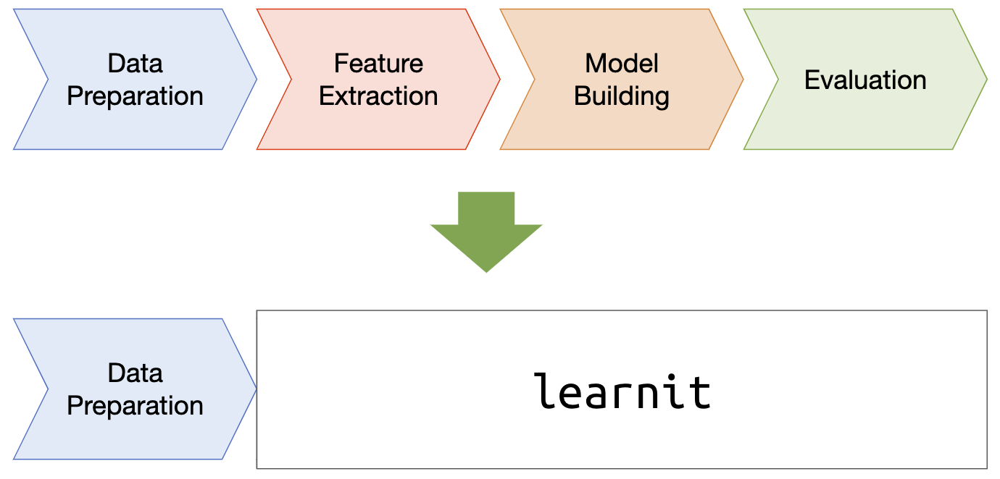

# LearnIt: A Tool for Machine Learning Beginners

1. [Introduction](#Introduction)
2. [Installation](#Installation)
3. [Quick Tour](#Quick-Tour)
4. [Sample Code](#Sample-Code)
5. [Contributors](#Sample-Code)
5. [Contact](#Contact)


<a name='Introduction'></a><h2> Introduction: Machine Learning Made Easy </h2> 


LearnIt makes the machine learning pipeline easy for you. What you need is just a CSV file and you can quickly
obtain a trained machine learning model with evaluation results. You don't have to manually extract features or 
select machine learning algorithms or tune hyper-parameters or evaluate trained models. 
LearnIt takes care of everything from end to end.



LearnIt is built on top of Pandas and Scikit-learn, popular data science tools, to minimize additional learning cost. You can also register your own feature extraction templates into the library to make LearnIt better. 


<a name='Installation'></a><h2> Installation </h2> 

You can install LearnIt (`learnit`) with `pip` command.

```
$ pip install learnit
```

or

```
$ pip install git+http://git@github.com/megagonlabs/learnit.git
```


<a name='Quick-Tour'></a><h2> Quick Tour </h2> 

```
import pandas as pd
from learnit.autoconverter.autoconverter import AutoConverter
from learnit.autolearn.autolearn import AutoLearn

# Load data as pd.DataFrame
df = pd.read_csv("data/train.csv")

# Create AutoConverter instance and convert
ac = AutoConverter(target="Survived")
X, y = ac.fit_transform(df)

# Model selection
al = AutoLearn()
al.learn(X, y)
```

Please also see a detailed [step-by-step tutorial](docs/step_by_step_tutorial.md).


<a name='Sample-Code'></a><h2> Sample Code </h2> 

- [iPython notebooks](notebooks) 
- [Sample code](sample)


<a name='Contributors'></a><h2> Contributors </h2> 

- Hideki Awashima ([@haisland0909](https://github.com/@haisland0909))
- Kate Pavlovic ([@katepavlovic](https://github.com/katepavlovic))
- Yoshihiko Suhara ([@suhara](https://github.com/suhara))


<a name='Contact'></a><h2> Contact </h2> 

Please create GitHub issues and PRs. For private communication, please contact Megagon Labs LearnIt Team (`learnit@megagon.ai`)

