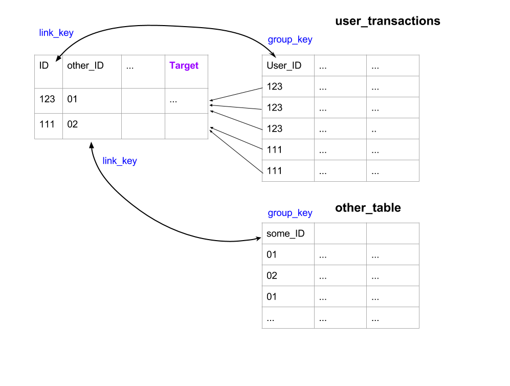
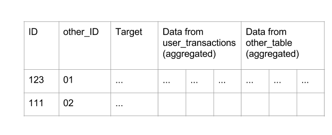

Sometimes not all the data is stored in one table. For example you can have some user information in one table and some additional data in other tables, such as transactions, user activity logs etc. If you are trying to predict something about one user you can have hundreds of transactions for each user. And you want to use this data too.

If you have multiple data tables you want to use for your task you can use
AutoConverter for linking these tables and grouping values. You can find sample python file [here](/sample/sample_multitable.py).

Let's have an example: You need to predict churn of the users and you have two
tables:
1) users table. This table consists of users, some information about them and, most importantly the target values (labels for prediction). The latter suggests that this should be the main table for the purpose of `AutoConverter`. This table also contains ID column that we are going to use to link it to the second table.


| ID | City | Gender | Age | Is_churn (target) |
|-----------------|---------------|--------|-----|---------|
| 12345| 1| M | 55| 1|
| 43211| 2| F | 22| 0 |
| 12344| 3| F | 2 | 0|
| ...| ...| ... | ... | ...|

2) user_transactions table: this table consists of separate transaction records. Each user, represented by User_ID, can have multiple transactions. In order to get a single feature matrix for our learning algorithm, we will need to group this information by User_ID before we merge user table with user_transactions table. But don't worry! `AutoConverter` will take care of this!

| User_ID | Transaction_Date | Amount | ... |
|-----------------|---------------|--------|-----|
| 12345| 01/01/2010| 223 | ...|
| 12345| 01/02/2010| 222 | ...|
| 12345| 01/03/2010| 13 | ...|
| 43211| 01/01/2010| 17 | ...|
| 43211| 01/01/2010| 234 | ...|
| 12344| ...| ... | ... |


First let's load the data and create the instance of `AutoConverter` class:
```
df_main = pd.read_csv('path to users table')
df_sub = pd.read_csv('path to transactions table')
ac = AutoConverter(target = 'is_churn')
```
Then we need to describe our table structure for the `AutoConverter`
```
subtables = {'transactions': {'table': df_sub,
                               'link_key': 'ID',
                               'group_key': 'User_ID'}}
```
Each record in `subtables` dictionary represent one additional table. `link_key' is the column name in the main table, used for linking this secondary table. `group_key` is the name of the secondary table column that is used for linking the tables. `group_key` is also used for grouping the values. In the above example records with different amounts and dates will be grouped by user_id before merging with the main table.

All we need now is just pass main dataset and subtables to the `AutoConverter`:
```
X, y = ac.fit_transform(df_main, subtables)
```
Now we can use feature matrix `X` and label vector `y` as usual!

### How it works

You can have any number of additional tables. Here's what happens in case of two additional tables:

This is schematical representation of what happens to three tables:


PS. Side note: you may wonder, why you should use `AutoConverter` instead of just joining these two tables in SQL. SQL joins can well handle mean, count and summation operations, but taking care of categorical values can be a real hassle in general case. For categorical values, say 'red', 'green', 'blue' you can't really calculate sum. Instead you might want to know: what's the amount of 'red' values compared to the other records in the data?
